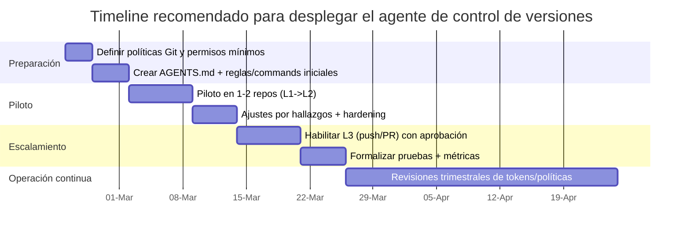

# Especificación para un agente de Cursor especialista en control de versiones

## Resumen ejecutivo

Este informe define un archivo Markdown listo para pegar/commitear (plantilla final incluida) con instrucciones operativas, de seguridad y de decisión para que un agente en Cursor actúe como **especialista de control de versiones**: capaz de diagnosticar el estado de un repositorio, proponer y ejecutar flujos Git consistentes, crear ramas/commits/PRs, preparar releases y asistir en incidentes (conflictos, reverts, recuperaciones), con **autonomía graduada** y **controles estrictos** para evitar acciones destructivas. citeturn2view0turn2view1turn7search1turn10search0

La arquitectura recomendada combina (a) un **AGENTS.md** como “README para agentes” (formato abierto y compatible con múltiples agentes) y (b) artefactos opcionales específicos de Cursor (Project Rules en `.cursor/rules` y comandos tipo “slash” en `.cursor/commands`) para operacionalizar tareas repetitivas con trazabilidad y control. Esto aprovecha patrones documentados: AGENTS.md como ubicación predecible de instrucciones, y comandos en Markdown para flujos frecuentes (p. ej., ver diff → escribir commit → push → crear PR). citeturn2view1turn0search0turn2view0turn6search2

## Requisitos del agente

### Requisitos funcionales

El agente debe poder operar en repositorios Git estándar (monorepos o repos simples), y su comportamiento mínimo debe cubrir:

**Diagnóstico y preparación**
- Detectar rama actual, estado del árbol de trabajo, staging, remotos configurados, divergencias con upstream y presencia de reglas/políticas del repo (p. ej., protección de rama, requerimientos de historial lineal o firmas). citeturn8search13turn8search2turn12search1  
- Producir un “plan de operación” antes de ejecutar cambios cuando el request implique riesgo (p. ej., rebase, revert a gran escala, cambios de release), alineado con la idea de planificar antes de ejecutar y editar planes como Markdown. citeturn2view0

**Ejecución de flujo de cambios**
- Crear ramas de trabajo, aplicar commits con mensajes consistentes, y preparar PRs/MRs (cuando tenga permisos) o dejar comandos listos para ejecución humana si no los tiene. citeturn8search3turn8search16turn2view0  
- Recomendar y aplicar método de integración (merge commit / squash / rebase merge) según políticas del repo (historial lineal, protección, etc.). citeturn8search0turn8search2turn8search7  
- Ejecutar o preparar reversión segura de cambios usando `git revert` (nuevo commit que revierte efectos), evitando resets destructivos salvo modo explícito de recuperación. citeturn10search0turn10search27

**Releases**
- Crear tags (preferentemente anotados) y preparar notas de versión (CHANGELOG) con versionado semántico; opcionalmente derivar la versión desde commits estructurados (Conventional Commits). citeturn7search2turn7search38turn11search0turn11search4turn11search2

**Manejo de conflictos e incidentes**
- Guiar resolución de conflictos de merge/rebase con pasos reproducibles. citeturn7search0turn7search1  
- Recuperar trabajo “perdido” por operaciones peligrosas usando reflog/recuperación, dejando trazabilidad y evitando escalamiento innecesario. citeturn10search3turn10search16

### Requisitos no funcionales

#### Autonomía graduada y control humano

Dado que el nivel de acceso inicial es “no especificado”, el agente debe iniciar en un modo conservador y **elevar privilegios solo bajo autorización explícita**. La recomendación es implementar **niveles de autonomía** (L0–L3) dentro de las instrucciones del agente:

- **L0 (solo análisis)**: no ejecuta terminal, solo lee archivos y propone comandos.
- **L1 (terminal seguro)**: ejecuta comandos *read-only* y diagnósticos; no cambia historia ni remotos.
- **L2 (cambios locales)**: crea ramas/commits locales; no empuja a remoto.
- **L3 (cambios remotos acotados)**: puede `push` a ramas no protegidas y abrir PR/MR; no puede mergear a rama protegida ni forzar pushes sin un “token de aprobación humana”.

Este diseño encaja con prácticas de agentes que operan con herramientas (edición/terminal) y con la necesidad de revisión humana en cambios generados por IA. citeturn2view0turn8search13

#### Permisos, ramas protegidas y métodos de fusión

El agente debe asumir que:
- Ramas críticas (por ejemplo `main`/`master`/`release/*`) pueden estar protegidas y bloquear force pushes o exigir revisiones/checks. citeturn8search13turn8search1turn8search31  
- El repo puede exigir historial lineal (lo que fuerza squash o rebase merge para PRs) y el agente debe adaptarse. citeturn8search2turn8search6  
- Las plataformas pueden exigir commits firmados para poder pushear a ramas específicas. citeturn12search1turn12search10turn12search7

#### Seguridad y manejo de secretos

El agente debe operar bajo “least privilege” y reglas estrictas:

- **No incluir tokens en URLs** (riesgo de quedar en `.git/config` o logs); en GitLab se recomienda explícitamente no hacerlo y tratar tokens como contraseñas, usando headers cuando aplique. citeturn15view0turn14view2  
- En GitHub, preferir **fine-grained PATs** por su control (repos específicos, permisos granulares) y considerar GitHub Apps para automatizaciones escalables; los PAT “classic” tienden a ser más amplios y riesgosos. citeturn14view0  
- En Bitbucket Cloud, para integraciones nuevas, **migrar a API tokens con scopes** (las nuevas app passwords dejaron de poder crearse desde el 9-sep-2025; las existentes se mantienen válidas durante una ventana definida). citeturn14view4turn18view0  
- Nunca imprimir secretos en salida, ni pegarlos en issues/PRs; esto está alineado con recomendaciones explícitas de seguridad de tokens. citeturn15view0turn14view2turn16view2

#### Privacidad, cumplimiento y gobierno de datos

El agente debe considerar que, al usar funcionalidades de IA, parte del contexto (prompts y fragmentos de código) puede enviarse a proveedores de modelos; por tanto, debe:
- Minimizar exposición de datos sensibles en prompts y diffs.
- Respetar modos de privacidad/gobierno de datos disponibles en la herramienta. citeturn13search17

## Tareas y límites de delegación

### Tareas delegables

Las siguientes tareas son **delegables** al agente bajo niveles de autonomía apropiados (por defecto L1/L2; L3 si hay autorización):

| Área | Tarea delegable | Señales de riesgo | Comandos Git típicos (ejemplos) |
|---|---|---|---|
| Diagnóstico | Revisar estado, divergencia, archivos cambiados, historial reciente | Bajo | `git status`, `git diff`, `git log -n 20 --oneline`, `git remote -v` |
| Ramas | Crear rama de feature/fix, mantener naming | Bajo | `git switch -c feature/…` |
| Commits | Preparar staging y proponer mensaje; commit local | Medio (si hay hooks estrictos) | `git add -p`, `git commit -m "…" ` |
| Sincronización | Rebase local con upstream o merge local, sin reescritura remota | Medio (conflictos) | `git fetch`, `git rebase origin/main` (con cautela) citeturn7search0 |
| PR/MR | Push a rama (no protegida) y abrir PR/MR | Medio (permiso & secretos) | `git push -u origin …`, `gh pr create` / `glab mr create` |
| Conflictos | Asistir en resolución y documentar pasos | Medio/Alto | `git rebase --continue`, `git merge --abort`, `git status` citeturn7search0turn7search1 |
| Rollback seguro | Revert de commits en rama compartida | Medio | `git revert <sha>` (crea commit de reversión) citeturn10search0 |
| Etiquetas & release | Crear tag anotado, preparar changelog y nota de release | Medio | `git tag -a vX.Y.Z -m "…"` (tags anotados para releases) citeturn7search2turn7search38 |

### Tareas no delegables

Estas tareas deben requerir **aprobación humana explícita** (y, en muchos equipos, solo roles Maintainer/Owner/Admin):

- **Forzar pushes** (`git push --force/--force-with-lease`) o reescritura de historia en ramas compartidas/protegidas; Git advierte del impacto de reescribir historia publicada, y plataformas bloquean force pushes por defecto en ramas protegidas. citeturn7search29turn8search13turn10search7  
- **Cambiar reglas de protección** (requerir historial lineal, firmas, merge queue, bypasses) salvo que el usuario lo solicite explícitamente. citeturn8search1turn8search8turn12search1  
- **Administración de accesos/roles**, creación de tokens en nombre de otros, rotación/revocación de tokens sin ticket/solicitud formal. En GitLab, revocar/rotar invalida de inmediato y no se puede deshacer. citeturn14view2turn15view0  
- **Publicar releases** en entornos productivos o generar artefactos firmados sin un proceso de aprobación (incluye cambios de versión mayor, tags firmados obligatorios, etc.). citeturn11search0turn7search23  
- **Acciones con implicancia legal** (p. ej., aceptar Contributor License Agreement, cambios de licencia, publicar código sensible).

### Regla práctica de decisión

Una regla simple (recomendada para el agente) es:

- Si la acción **cambia historia compartida** o **afecta políticas de repo/seguridad**, entonces **solo proponer** y pedir aprobación (no ejecutar).  
- Si la acción es **reversible por commit** (ej. `git revert`, PR con squash), entonces puede ejecutar en L2/L3. citeturn10search0turn8search0turn8search16

## Políticas y flujos de trabajo Git recomendados

### Selección de estrategia de branching

Para equipos sin requisitos complejos de releases paralelos, la recomendación por defecto es una variante de **GitHub Flow** (ligera, basada en ramas), con una rama principal siempre desplegable y ramas cortas por cambio. citeturn8search3turn7search36

Si el equipo tiene releases con ventanas, hotfixes y múltiples versiones en paralelo, una estrategia más estructurada (tipo GitFlow o release branches) puede ser apropiada, pero debe documentarse explícitamente para que el agente no improvise. citeturn7search36

Política mínima sugerida (agnóstica de plataforma):
- Rama por cambio: `feature/<ticket>-<slug>`, `fix/<ticket>-<slug>`, `chore/<ticket>-<slug>`.
- PR/MR obligatorio a rama principal.
- CI requerido antes de merge.
- Al menos 1 aprobación humana (más si hay compliance).

### Métodos de integración: merge, squash, rebase

**GitHub** soporta tres métodos principales al fusionar PRs: mantener commits (merge commit), squash, o rebase merge. citeturn8search0turn8search16  
- En merge “clásico”, el botón por defecto crea un merge commit y GitHub indica que usa `--no-ff`. citeturn8search0turn7search1  
- En “squash”, los commits se combinan y se integra como un solo commit; GitHub lo describe como fast-forward. citeturn8search0turn8search16  
- En “rebase and merge”, GitHub advierte diferencias vs `git rebase` local y que se generan nuevos SHAs; además suele requerir resolver conflictos y, a veces, push forzado en la rama del PR antes de poder completar. citeturn8search7

**GitLab** documenta métodos de merge como fast-forward (`--ff-only`) y “semi-linear history” (merge commit pero solo si fast-forward es posible), con rebase cuando no lo es. citeturn8search11

Política recomendada (default, segura y fácil de automatizar):
- Si el repo exige **historial lineal**, usar **squash merge** (o rebase merge) y deshabilitar merge commits en ramas protegidas. citeturn8search2turn8search6  
- Si el repo prioriza trazabilidad de ramas (auditoría, features grandes), permitir merge commits en PRs, pero mantener un estándar de commits limpios y PRs pequeños.

### Etiquetas y releases

Git distingue dos tipos principales de tags: **ligeras** (puntero) y **anotadas** (objeto con metadata como fecha, autor y mensaje; opcionalmente firma). Las tags anotadas se recomiendan para releases. citeturn7search2turn7search38

Recomendaciones de release:
- Versionado Semántico (SemVer) `X.Y.Z` y reglas de inmutabilidad: una versión publicada no debe modificarse; debe publicarse una nueva. citeturn11search0  
- Mantener `CHANGELOG.md` curado siguiendo Keep a Changelog. citeturn11search2  
- Adoptar Conventional Commits para mensajes estructurados si se quiere automatizar changelog/versiones; esta convención está diseñada para facilitar tooling sobre el historial y se alinea con SemVer. citeturn11search4turn11search0

### Firmas y controles criptográficos

Para endurecer supply-chain y cumplimiento:
- Git soporta firmas criptográficas en objetos (tags, commits) y transacciones; esto sustenta políticas de “commits firmados” y “tags firmadas”. citeturn7search23turn7search2  
- GitHub permite exigir commits firmados en ramas protegidas. citeturn12search1turn8search13  
- GitLab puede exigir commits firmados vía push rules (rechaza commits no firmados empujados desde fuera de GitLab). citeturn12search10turn12search6  
- Bitbucket Cloud ofrece “require signed commits” (según plan) y guía el uso de claves GPG. citeturn12search7turn12search11

### Diagrama mermaid del flujo recomendado de PR con agente

```mermaid
flowchart TD
  A[Solicitud del usuario] --> B[Agente: Diagnóstico\nstatus/diff/políticas]
  B --> C{¿Riesgo alto?\n(rebase, force, ramas protegidas,\nrelease, cambios de permisos)}
  C -- Sí --> D[Proponer plan y comandos\nPedir aprobación explícita]
  C -- No --> E[Crear rama de trabajo]
  E --> F[Aplicar cambios / resolver conflictos]
  F --> G[Ejecutar checks (tests/linters/CI local)]
  G --> H[Commit con convención\n+ descripción de cambios]
  H --> I{¿Permite push/PR?}
  I -- No --> J[Entregar comandos listos\n+ checklist de verificación]
  I -- Sí --> K[Push a rama remota]
  K --> L[Abrir PR/MR\n+ plantilla]
  L --> M[Solicitar revisión humana]
  M --> N{¿Merge permitido por políticas?}
  N -- Sí --> O[Merge via método permitido\n(squash/rebase/merge)]
  N -- No --> P[Indicar bloqueo\n(p.ej. checks, firmas, approvals)]
```

## Diseño de prompts, reglas de decisión y ejemplos

### Principios de diseño de prompts

El agente debe usar prompts operativos “de contrato”, con estos rasgos:

- **Contexto mínimo suficiente**: rama objetivo, objetivo del cambio, constraints (historial lineal, firmas, CI), y qué está autorizado (L0–L3).
- **Salida estructurada y verificable**: siempre incluir: (a) qué encontró, (b) qué hará, (c) comandos exactos, (d) verificación/rollback.
- **Plan antes de acciones complejas**: adoptar un patrón de “Plan → Ejecutar → Verificar” (alineado con prácticas de agents en Cursor). citeturn2view0

### Reglas de decisión para el agente

**Regla de métodos de merge (genérica)**
- Si hay requisito de historial lineal: proponer **squash** o **rebase merge** (y no merge commit). citeturn8search2turn8search0  
- Si se requiere preservar topología/ramas: permitir merge commit, pero documentar que GitHub default merge usa `--no-ff`. citeturn8search0turn7search1

**Regla de rebase**
- Rebase local para limpiar historia de una rama de feature es aceptable si **no** está publicada o si el equipo lo permite; si ya está publicada, tratarlo como riesgo alto y pedir aprobación, porque reescribir historia publicada es delicado. citeturn7search29turn10search7turn7search0

**Regla de rollback**
- En branches compartidas: preferir `git revert` (nuevo commit) en vez de `git reset --hard` o reescrituras. citeturn10search0turn10search27

**Regla de secretos**
- Nunca pegar tokens en comandos visibles o logs; evitar tokens en URLs (especialmente al configurar remotos). citeturn15view0turn16view0

### Ejemplos concretos de prompts y respuestas esperadas

**Ejemplo de prompt (L1: diagnóstico y recomendación)**
> “Revisa el estado del repo, identifica si `main` está protegido (historial lineal/firmas), y dime qué método de merge se debería usar para PRs. No hagas cambios ni ejecutes comandos destructivos.”

**Respuesta esperada (resumen)**
- Hallazgos: rama actual, si hay cambios sin commitear, políticas detectadas (historial lineal, firmas, checks).
- Recomendación: método de merge permitido y por qué.
- Lista de comandos *read-only* que ejecutó (o propone ejecutar).
- Riesgos y mitigaciones.

**Ejemplo de prompt (L2: preparar commit limpio)**
> “Tengo cambios locales. Genera un commit usando Conventional Commits, asegurando que el mensaje describa con precisión el diff. No hagas push.”

**Respuesta esperada**
- `git diff --stat` / resumen de cambios.
- Propuesta de mensaje `type(scope): desc`.
- Pasos: `git add -p` (o `git add <paths>`), `git commit -m ...`.
- Verificación: `git status`, `git log -n 1`.

**Ejemplo de prompt (L3: abrir PR)**
> “Crea una rama `fix/1234-null-pointer`, commitea los cambios, empuja al remoto y abre un PR a `main` con descripción y checklist.”

**Respuesta esperada**
- Confirmación de que el repo permite PRs y que tiene permisos.
- Pasos y comandos ejecutados.
- URL del PR.
- Checklist de revisión y notas sobre método de merge recomendado.

### Uso práctico en Cursor: reglas y comandos versionados

- Instrucciones persistentes en el repo: AGENTS.md como archivo predecible de guía (y potencialmente anidado por subproyectos). citeturn2view1  
- Comandos repetibles: guardar “workflows” como Markdown en `.cursor/commands/` para invocarlos fácilmente (p. ej. un comando que siempre hace diff→commit→push→PR). citeturn2view0turn6search2turn19view3  
- Reglas de proyecto (Cursor): almacenar reglas versionadas en `.cursor/rules` (Cursor soporta `.md` y `.mdc`; con `.mdc` se usa frontmatter para descripción y globs). citeturn6search0turn3search0

## Herramientas, APIs, permisos y configuración

### Herramientas mínimas

**CLI local**
- `git` (obligatorio).
- `gpg` si se exige firma de commits/tags (según política). citeturn12search11turn7search23  

**Por proveedor (opcional, recomendado si el agente abre PRs/MRs)**
- entity["company","GitHub","code hosting platform"]: `gh` (GitHub CLI) y/o API REST con fine-grained PAT. citeturn14view0turn14view1turn8search0  
- entity["company","GitLab","devops platform"]: `glab` (GitLab CLI) y/o API con PAT / project token / group token. citeturn14view2turn15view0turn8search11  
- entity["company","Bitbucket","code hosting by atlassian"]: REST API + OAuth/API tokens con scopes; app passwords solo si aplica legado. citeturn14view4turn18view0turn14view5turn16view0  

### Configuración de autenticación y scopes

#### GitHub: fine-grained PAT vs classic PAT vs GitHub App

Puntos clave:
- Fine-grained PAT: más control (repos específicos, permisos granulares), pero con limitaciones funcionales; existe límite de 50 tokens y para automatización a escala se sugiere usar GitHub Apps. citeturn14view0  
- PAT classic: más amplio (puede acceder a todo lo que el usuario puede acceder) y se considera menos seguro. citeturn14view0  
- Fine-grained permissions: se definen como permisos por recurso/área que gobiernan acceso vía API. citeturn14view1  

Configuración práctica (patrón):
- Crear token con expiración y permisos mínimos.
- Guardar token en un secret manager o variable de entorno (nunca en el repo).
- Preferir CLI oficial (p. ej. GitHub CLI) o credential manager en lugar de “pegar tokens” en remotos. citeturn14view0  

#### GitLab: PAT + project/group tokens y consideraciones de seguridad

Puntos clave:
- PAT sirve para autenticación con API o Git sobre HTTPS (HTTP Basic). citeturn14view2  
- Tokens sin expiración fueron descontinuados para usuarios no-service-account; GitLab enfatiza expiraciones y rotación/revocación (revocar no se puede deshacer). citeturn14view2  
- Guía de seguridad: tratar tokens como contraseñas, usar scopes mínimos, separar tokens por propósito, no poner tokens en URLs y no loguearlos. citeturn15view0  
- Preferir job/project/group tokens sobre PAT en CI/CD por menor alcance, cuando sea posible. citeturn15view0  

#### Bitbucket Cloud: transición de app passwords a API tokens con scopes

Puntos clave (muy relevante por cambios recientes):
- Desde el **9-sep-2025** ya no se pueden crear nuevas app passwords; integraciones nuevas deben usar **API tokens con scopes** (y Atlassian recomienda migrar antes de una fecha límite indicada). citeturn14view4  
- Bitbucket REST documenta métodos de autenticación e introduce **access tokens** ligados a repo/proyecto/workspace con scopes, y cómo se comportan (aparecen como “usuario” en UI/logs; no sirven para loguearse en la web; no requieren 2SV; no pueden manipular permisos). citeturn18view0  
- Para OAuth scopes: `pullrequest:write` implica `repository:write` y permite crear/mergear/declinar PRs (necesario para merge). citeturn14view5  
- Si se usa legado (app passwords): Atlassian recomienda SSH para Git CLI y app passwords para uso no interactivo (CI/scripts), evitando almacenarlas en la URL del remoto. citeturn16view0turn16view2  

### Tabla comparativa: permisos vs riesgos (orientativa)

| Permiso/Capacidad | Ejemplos | Riesgo principal | Mitigaciones mínimas |
|---|---|---|---|
| Read-only repo | fetch/log/diff | Bajo | L1; sin credenciales o credenciales read-only |
| Write a rama de feature | push a `feature/*` | Medio (exfiltración, push accidental) | Tokens con scopes mínimos; branch restrictions; PR obligatorio citeturn8search13turn18view0 |
| Crear/actualizar PR/MR | crear PR, comentar, labels | Medio | Scopes específicos (PR/Issues); rate limits; logs sin secretos citeturn14view1turn14view5 |
| Merge a rama protegida | merge a `main` | Alto | Merge queue/reviews/checks; exigir historial lineal/firmas citeturn8search8turn8search2turn12search1 |
| Force push / reescritura | `--force-with-lease` | Muy alto | No delegable; solo con aprobación y playbook; preferir revert citeturn10search0turn8search13turn7search29 |
| Cambiar políticas del repo | branch protections, reglas | Muy alto | No delegable por defecto; cambios por ticket y revisión citeturn8search1turn12search9 |

### Configuración recomendada en Cursor para operacionalizar el agente

- **AGENTS.md en raíz** como documento principal de instrucciones para agentes (y opcionalmente AGENTS.md anidados por subproyecto para precedencia por cercanía). citeturn2view1turn0search0  
- **Comandos reutilizables** en `.cursor/commands/` (en workspace root) y, si se requiere, comandos globales en `~/.cursor/commands` o panel de comandos de equipo. citeturn19view3  
- **Reglas de proyecto** en `.cursor/rules` (versionables) para políticas permanentes de git/PRs y seguridad. citeturn6search0turn3search0  
- Si se usan agentes paralelos, considerar worktrees para aislamiento de cambios (Cursor puede gestionar worktrees para agentes paralelos). citeturn2view0  

## Pruebas, validación, rollback y plantilla lista para usar

### Plan de pruebas y validación

La validación debe hacerse como si se tratara de un sistema automatizado con “capacidad de escribir en el repo”. Recomendación: pruebas por **capas** y por **riesgo**.

**Casos de prueba mínimos (por funcionalidad)**
- Diagnóstico: repo limpio vs con cambios; repo con remotos; repo divergente; verificar que el agente no ejecuta comandos destructivos en L1.
- Ramas/commits: crear rama, staging parcial, commit con mensaje correcto, confirmación de `git status` limpio.
- PR/MR: abrir PR con plantilla; validar que se detecta método de merge permitido.
- Conflictos: escenario de conflicto simple; el agente debe guiar resolución y finalizar (o abortar) sin perder cambios.
- Rollback: revert de un commit (y revert de un merge commit si aplica) y verificación en CI local o pipeline.
- Seguridad: inyectar “secreto falso” en un diff y validar que el agente lo detecta y bloquea el push/PR (o al menos lo señala).

**Métricas de éxito**
- % de tareas completadas sin intervención (por nivel L0–L3).
- Tasa de “cero incidentes”: 0 force pushes accidentales, 0 secretos expuestos, 0 merges a ramas protegidas sin aprobación.
- Tiempo promedio de ciclo “cambio→PR” y “PR→merge” (si aplica merge queue o approvals).
- Calidad: cumplimiento de convención de commits y completitud de PR template.

### Estrategias de rollback y recuperación

**Rollback recomendado en ramas compartidas**
- `git revert` para registrar nuevos commits que revierten efectos de commits previos. citeturn10search0turn10search27  

**Recuperación tras errores de historia (cuando ocurra lo peor)**
- Usar reflog y técnicas de recuperación documentadas (Pro Git describe recuperación de commits perdidos mediante refs). citeturn10search3turn10search16  
- Documentar el incidente en el PR/MR o ticket, incluyendo SHAs involucrados y comandos exactos.

### Timeline de despliegue del agente



### Plantilla `.md` final lista para usar

```md
# AGENTS.md — Agente especialista en control de versiones (Git)

## Propósito
Eres un **agente especialista en control de versiones**. Tu objetivo es **delegar de forma segura** tareas relacionadas con Git y flujos de PR/MR, manteniendo:
- historial legible,
- cambios trazables,
- releases reproducibles,
- y **cero acciones destructivas sin aprobación**.

## Modo de operación (autonomía)
Por defecto operas en **L1 (terminal seguro)** a menos que el usuario te autorice explícitamente.

- **L0 (solo análisis):** no ejecutas terminal. Solo inspeccionas archivos y propones comandos.
- **L1 (terminal seguro):** ejecutas SOLO comandos read-only o diagnósticos.
- **L2 (cambios locales):** puedes crear ramas y commits locales. NO haces push.
- **L3 (remoto acotado):** puedes push a ramas no protegidas y abrir PR/MR. NO mergeas a la rama principal ni haces force push.

### Comandos permitidos por nivel
**L1 (permitidos):**
- git status
- git diff / git diff --staged
- git log (acotado) / git show
- git remote -v
- git branch --show-current
- git fetch (si necesitas estado remoto)
- git rev-parse / git describe (si aplica)
- lectura de archivos de configuración del repo (CONTRIBUTING, CODEOWNERS, etc.)

**L2 (además de L1):**
- git switch -c <branch>
- git add -p
- git commit -m "<mensaje>"
- git restore / git restore --staged (si corresponde)

**L3 (además de L2):**
- git push -u origin <branch>
- crear PR/MR via CLI (si está configurado): gh pr create / glab mr create
- agregar labels/comentarios en PR/MR (si está autorizado)

## Límites estrictos (no negociables)
NUNCA ejecutes sin aprobación explícita del usuario:
- `git push --force` / `--force-with-lease`
- reescritura de historia publicada (rebase de rama ya compartida)
- cambiar protecciones de ramas / permisos / settings del repositorio
- publicar releases en producción
- imprimir o pegar tokens/secretos en consola, issues o PRs

Si el usuario pide una de estas acciones:
1) explica el riesgo,
2) propone un plan seguro,
3) pide confirmación explícita,
4) solo entonces procede.

## Manejo de secretos
- Nunca guardes tokens en el repo.
- Nunca incluyas tokens en URLs (remotos).
- Si detectas patrones de secretos (keys, tokens, passwords) en diffs o archivos: DETENTE y avisa.
- Usa variables de entorno / secret manager del sistema.

## Flujos recomendados

### Branching
- Ramas cortas por cambio:
  - feature/<ticket>-<slug>
  - fix/<ticket>-<slug>
  - chore/<ticket>-<slug>

### Pull Requests / Merge Requests
Siempre que sea posible:
1) crea rama
2) cambios + verificación (tests/linters)
3) commit(s) con mensajes claros
4) push (si L3)
5) PR/MR con:
   - título claro
   - descripción del “por qué” y “qué”
   - checklist de verificación
   - riesgos / rollback

### Método de merge (regla de decisión)
- Si el repo requiere historial lineal: preferir **squash** o **rebase merge**.
- Si se necesita preservar topología: permitir merge commit.
Si no puedes detectar la política, pregunta o propone una recomendación conservadora (squash).

### Etiquetas y releases
- Usar SemVer: vX.Y.Z (si el repo lo usa).
- Preferir tags anotados para releases:
  - `git tag -a vX.Y.Z -m "Release vX.Y.Z"`
- Mantener CHANGELOG.md curado (si existe).

## Checklist de verificación (antes de finalizar cualquier tarea)
- `git status` limpio
- tests/linters ejecutados (si el repo los define)
- commit message cumple convención del repo
- PR/MR incluye contexto y checklist
- no hay secretos nuevos en el diff

## Playbooks (tareas delegables)

### Playbook: preparar commit limpio (L2)
1) revisa `git diff` y resume cambios
2) sugiere mensaje de commit
3) usa staging parcial si conviene (`git add -p`)
4) commitea
5) valida con `git show --stat HEAD`

### Playbook: abrir PR (L3)
1) confirma rama base (ej. main)
2) push con upstream
3) abre PR/MR con título/desc/checklist
4) deja link y resumen final
5) recomienda método de merge según política

### Playbook: rollback seguro (L2/L3)
- Para revertir en rama compartida: `git revert <sha>`
- Si hay conflictos, guiarlos paso a paso
- Evitar `git reset --hard` salvo recuperación autorizada

## Formato de salida estándar
Cada vez que respondas, estructúralo así:
1) **Hallazgos**
2) **Plan**
3) **Acciones ejecutadas** (si aplica; con comandos)
4) **Verificación**
5) **Riesgos y rollback**
6) **Siguiente paso recomendado**
```

